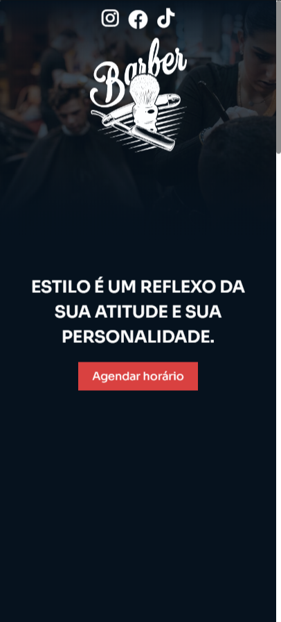
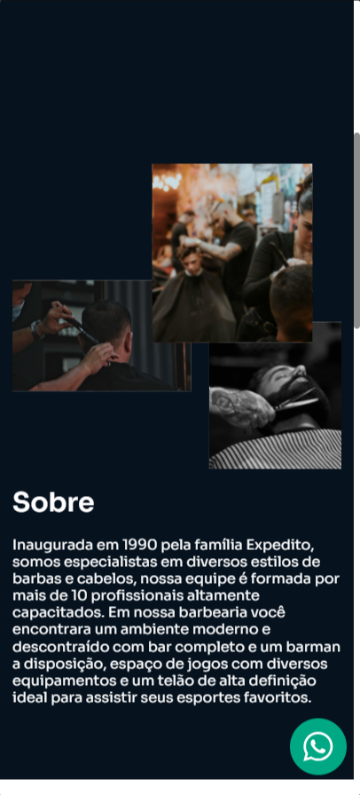
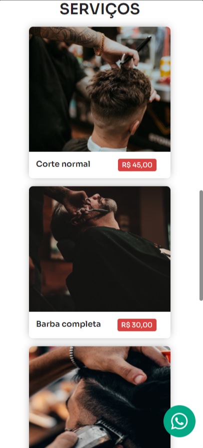
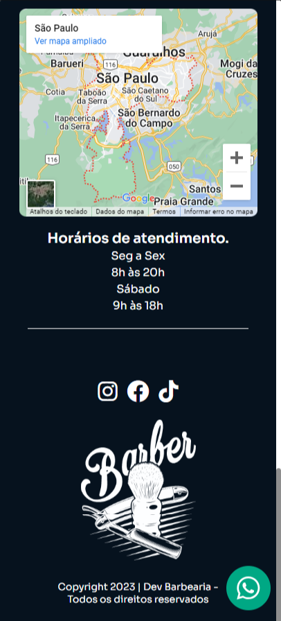

<h1 align="center">Landing page Barbearia</h1>
 
Landing page inspirada em uma barbearia, desenvolvida com HTML, CSS, pré-processador SCSS e para as animações utilizei a biblioteca Animate On Scroll Library.

Confira a aplicação aqui. <a href="https://barberdev.netlify.app/" 
target="_blank">Link Deploy🔗</a>
  
## Layout 💻
  

## Mobile 📱

 

## Tecnologias utilizadas 👨🏻‍💻
- HTML
- CSS
- SCSS
- AOS - Animate On Scroll Library
